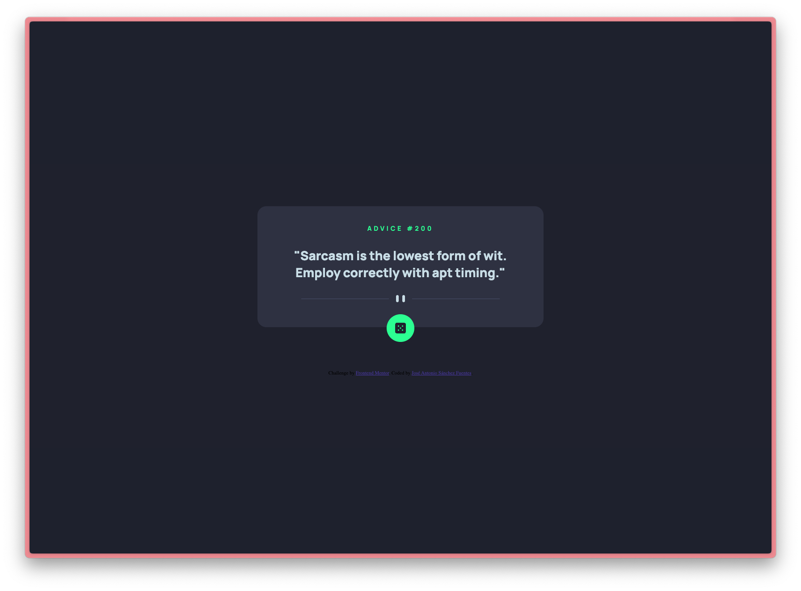

# Frontend Mentor - Advice generator app

This is a solution to the [Advice generator app challenge on Frontend Mentor](https://www.frontendmentor.io/challenges/advice-generator-app-QdUG-13db). Frontend Mentor challenges help you improve your coding skills by building realistic projects. 

## Table of contents

- [Overview](#overview)
  - [Screenshot](#screenshot)
  - [Links](#links)
- [My process](#my-process)
  - [Built with](#built-with)
- [Author](#author)
- [Acknowledgments](#acknowledgments)

## Overview

### Screenshot

### Links

- Solution URL: [Add solution URL here](https://crimson3d.github.io/frontend-mentor-html-css-challenges/challenges/advice-generator-app-main/index.html)

## My process

### Built with

- Semantic HTML5 markup
- CSS custom properties
- Flexbox
- Media Query
- JavaScript

## Author

- Website - [José Antonio Sánchez Fuentes](https://crimson3d.github.io/frontend-mentor-html-css-challenges/index.html)
- Frontend Mentor - [@crimson3d](https://www.frontendmentor.io/profile/crimson3d)
- Github - [@crimson3d](https://github.com/crimson3d)
- Twitter - [@pixeltroll](https://www.twitter.com/pixeltroll)

## Acknowledgments

Thanks to all the people 

Many thanks to all the people who support me in this new adventure, to Paul Guillamon (https://github.com/Qu4k3), my master Yoda and mentor to become a developer, to May, the best companion and love I could ever have, and to Lara, probably the reason why now I'm doing this. Love.

